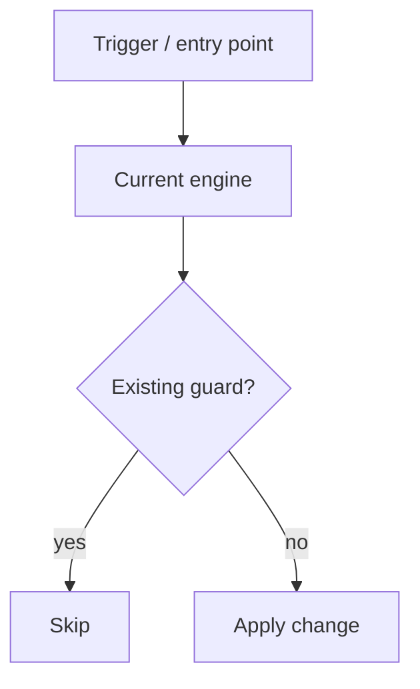
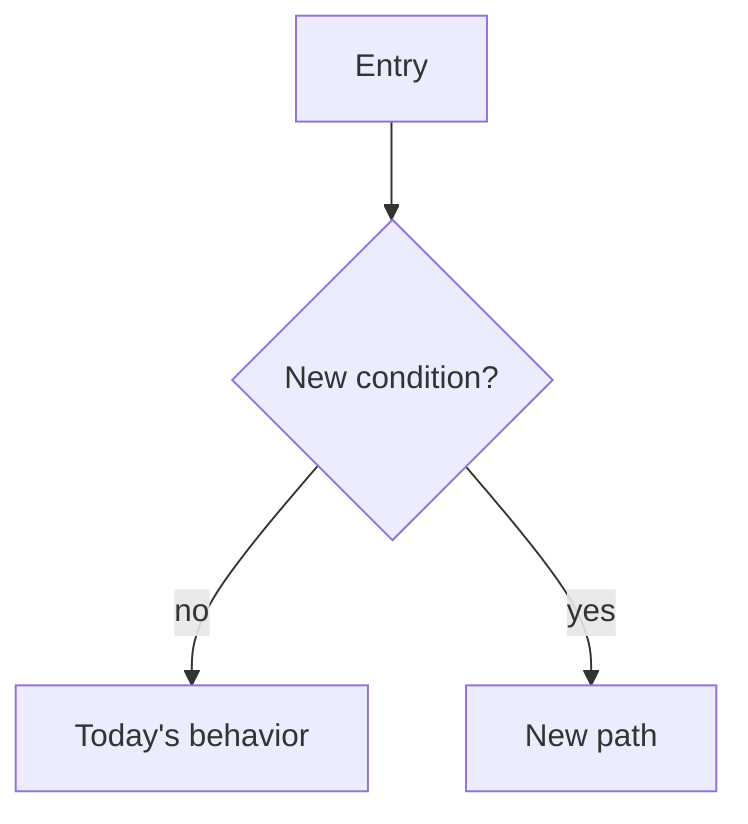

<!--
  TEMPLATE: Low-Level Design (LLD)
  ================================
  Copy this file to docs/lld/<work-id>-<short-kebab-slug>.md and fill it in.
  Delete every <!-- ... --> guidance comment as you go.
  Strip any section that genuinely does not apply (write "n/a — <reason>").

  Naming: <work-id>-<short-kebab-slug>.md
    Good: 1443813-deny-keeps-shared-parent-pending.md, add-bulk-import-pipeline.md
    Bad:  lld1.md, design.md, TICKET-123.md (id alone, no description)

  What an LLD is: the design record for a non-trivial change — what the system
  does TODAY, the precise gap the work closes, and the proposed minimal change,
  with alternatives and cascading impact. Author it BEFORE writing code (during
  the pre-coding analysis phase); it is the deeper design artifact that the
  changes/<slug>.md doc summarizes and links to. See .cursor/rules/documentation-workflow.mdc.

  Companion docs (OPTIONAL — create only when warranted, see the rule):
    - <work-id>-questions-and-kt.md  — open questions for stakeholders + reverse-KT
    - <work-id>-walkthrough.md       — session walkthrough + decision capture
-->

# LLD — <work-id>: <short title of the change>

**Date:** YYYY-MM-DD
**Environment (analysis):** `<env / sandbox / data store the analysis ran against>`
**Lead:** <Name> (<role>)
**Work item / ticket:** [<TRACKER-NNN>](<url>) — <one-line summary>
**Status:** Draft — design phase (no code yet) / In review / Approved for build / Superseded
**Related docs:** <links to the questions-and-kt doc, the walkthrough doc, and the changes/<slug>.md doc, when they exist>

> <One-paragraph summary: what this LLD covers, and explicitly call out any
> predicate or behavior still pending stakeholder confirmation — link to the
> questions-and-kt doc for those.>

---

## 1. Purpose & scope

**Goal:** <what the change must achieve, in 1-3 sentences tied to the AC.>

**In scope (code):** <the specific component(s) / path(s) this work changes.>

**Out of scope (documented as context):**

- <related work handled elsewhere — name it and link if possible.>
- <data remediation / sibling work / UX — explicitly excluded so it is not assumed.>

---

## 2. Intake — transcribed requirement & acceptance criteria

<!-- Paste the requirement + AC TEXT transcribed at intake. Never "see screenshot". -->

### 2.1 Description (the "why")

> <transcribed problem statement / user story, verbatim.>

<A concrete real-world example from the ticket, if one exists.>

### 2.2 Acceptance criteria (the "what")

> **AC1** — Given <precondition> / When <action> / Then <expected outcome>
> **AC2** — ...

### 2.3 Out of scope (explicitly)

- <non-goal called out in the ticket / intake.>

---

## 3. Domain mapping (business term -> system component)

<!-- Translate each business term into the concrete component / record / table /
     field the design touches. Keeps the rest of the doc unambiguous. -->

| Business term | System component | Key fields / attributes used |
|---|---|---|
| <term> | <object / table / service / module> | <fields / columns the change reads or writes> |

---

## 4. Current behavior (as built)

<!-- How the system behaves TODAY on the path you are about to change. Cite the
     concrete entry points, the engine/component, and what it does AND does not
     do. A mermaid flowchart of the current path helps. -->

### 4.1 Entry points

<how the path is triggered today — UI action, API call, scheduled job, event.>

### 4.2 The engine / component

<the single place the behavior lives (file / path); what it changes and what it
leaves untouched.>



---

## 5. Gap analysis — why the change is needed

<!-- The precise delta between current behavior (§4) and the AC (§2). Enumerate
     the specific gaps; this is the heart of the LLD. -->

1. <gap 1 — what today's logic misses, and why.>
2. <gap 2 ...>

**Conclusion:** <one sentence stating what must be added / changed to close the gap.>

---

## 6. Before-state evidence (read-only)

<!-- Prove the problem exists and gauge blast radius with READ-ONLY queries
     against real data. Paste the query + the headline result (counts, sample
     ids). This justifies the work AND sizes the bulk-safety requirement. -->

```sql
<read-only query>
```

- <headline finding — counts, max fan-out, a concrete sample record / id.>

---

## 7. Proposed design

### 7.1 Principle

<the guiding constraint — e.g. "surgical and additive; reuse the existing
mechanism; do not change what X does today.">

### 7.2 Mechanism

<the new detection / logic / data change. Pseudocode or a short snippet is fine;
keep it implementation-shaped, not the final code.>

### 7.3 Where it plugs in

<the exact insertion point(s) in the existing flow; what stays unchanged.>



### 7.4 Why this approach

<blast radius, bulk-safety, consistency with existing patterns.>

### 7.5 Alternatives considered

| Option | Pros | Cons | Why (not) chosen |
|---|---|---|---|
| <chosen> | <pros> | <cons> | (chosen) |
| <alternative> | <pros> | <cons> | <reason rejected> |

---

## 8. Affected components (touched surface)

<!-- The output of the pre-coding "identify the surface" step. One row per
     component the build will touch. -->

| Component | Path | Change |
|---|---|---|
| <name> | [`<path>`](<path>) | <add / modify / read-only reference> |

---

## 9. Cascading impact

<!-- Walk the downstream automation / effects the change triggers. Flag intended
     vs accidental. For data-heavy runtimes, note whether the change writes MORE
     or FEWER records than today. -->

- <effect 1 — intended / accidental, and why.>
- <effect 2 ...>

---

## 10. Draft test scenarios

<!-- The scenarios the build must cover, derived from the ACs + gap analysis.
     Finalize after any open questions are answered. -->

| # | Scenario | Expected |
|---|---|---|
| 1 | <happy path> | <expected> |
| 2 | <negative / edge case> | <expected> |
| 3 | <regression: existing behavior unchanged> | <unchanged> |

Coverage target: <the project's required coverage>.

---

## 11. Open questions & reverse-KT

<!-- The design assumptions that need stakeholder confirmation. If there are
     several, or a live session is warranted, spin them out into the companion
     <work-id>-questions-and-kt.md (and <work-id>-walkthrough.md for the session). -->

The design above assumes, pending confirmation:

- <assumption 1 — link to the matching question in the questions-and-kt doc.>
- <assumption 2.>

---

## 12. Pre-implementation checklist (gated)

<!-- The steps before / at build time. Pull the latest source (the org / repo is
     the source of truth), reproduce the gap, implement, test, document. -->

1. Pull the latest version of the components in §8 and re-validate §4-§5 against the fresh copy.
2. Reproduce the exact failing condition; capture before / after.
3. Implement the design in §7; add the tests in §10.
4. Build / deploy, run the targeted tests, and check logs for hidden failures.
5. Finalize the changes/<slug>.md doc and follow the two-commit strategy.

---

## 13. References

- <engine / component paths.>
- <related rules / docs / sibling work.>
